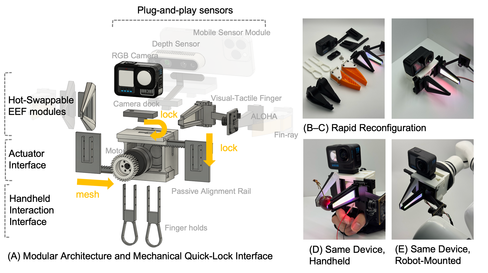

# RAPID: Reconfigurable, Adaptive Platform for Iterative Design
[[Project page]](https://rapid-kit.github.io/) [[Paper]](https://rapid-kit.github.io//#paper) [[Hardware Guide]](hardware/instruction.md)


[Zi Yin](https://github.com/aod321), [Fanhong Li](https://github.com/fanhong-li), [Shurui Zheng](https://github.com/Ziegel-Thu), [Jia Liu](https://scholar.google.com/citations?user=xPoVpSEAAAAJ&hl=en)

Tsinghua University

## Getting Started

1. [Print and Assemble the Hardware](hardware/instruction.md)
2. Set Up the Hardware Driver: refer to the [rapid_driver](https://github.com/aod321/rapid_driver) repository
3. Collect Demonstration Data: follow the instructions below

## Handheld Pipeline (Recommended)

### Stage 1: Data Collection

UMI-style Go Pro pipeline: https://github.com/aod321/zumi_pipeline

iPhone pipeline: *Coming soon*

### Stage 2: Training

1. Follow the installation instructions in the original UMI repository.

2. Place the Zarr dataset obtained from Stage 1 into the workspace directory, then run:

   ```bash
   python train.py --config-name=train_diffusion_unet_timm_umi_workspace task.dataset_path=[ZARR DATASET PATH]
   ```

### Stage 3: Inference

Options:

1. Realman RM75: Please contact us for integration details.
2. UR5: Community contributions welcome.
3. Franka Panda: Community contributions welcome.

## LeRobot Pipeline

Hardware:

- [Dummy Robot v2](https://www.bilibili.com/video/BV18x421Q7Td/?spm_id_from=333.337.search-card.all.click&vd_source=37a31ba08a1cea640252b9baeef296ea) 

- Ref Controller Firmware: https://github.com/aod321/50_arm_dummy-ref-core-fw

  - Set DM3510 ID before integrating RAPID into this robot:

    ```
    SLAVE_ID = 0x37
    MASTER_ID = 0x47
    ```
  
- Main Camera and Gripper Camera: logitech c922 pro

Software:

https://github.com/aod321/lerobot

- Install:

```
  git clone https://github.com/aod321/lerobot.git
  cd ./lerobot
  uv venv
  uv sync
```

- Teleop Data Collection

```
python scripts/record_dummy.py --resume --camera-index 2 --wrist-camera-index 0 -n 50 --dataset [HUGGINGFACE_DATASET_ID] --camera-width 320 --camera-height 240
```

- Training

```
CUDA_VISIBLE_DEVICES=1 lerobot-train --policy.type=diffusion --dataset.repo_id=[HUGGINGFACE_DATASET_ID] --output_dir=outputs/RAPID_dummy_pick_place_green_cube_GET_0127 --policy.repo_id=[HUGGINGFACE_POLICY_ID]
```

- Inference:

```
lerobot-teleoperate --robot.type=dummy_follower --robot.serial_number=396636713233 --robot.cameras='{"top":{"type": "opencv", "index_or_path": 0, "width": 320, "height": 240, "fps": 30}, "wrist": {"type": "opencv","index_or_path": 2, "width": 320, "height": 240, "fps": 30}}' --policy.path=[HUGGINGFACE_POLICY_ID]
```

